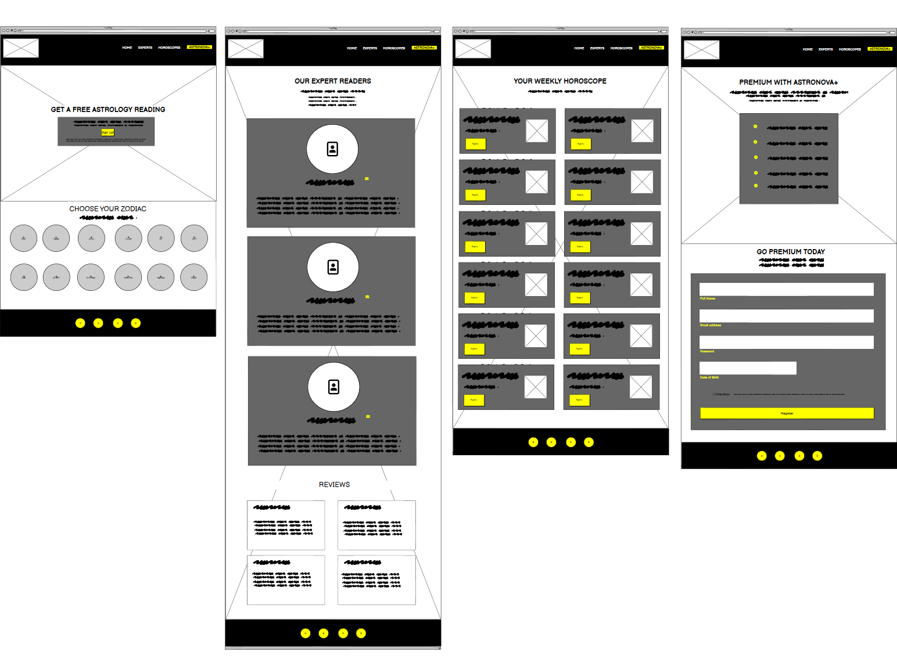
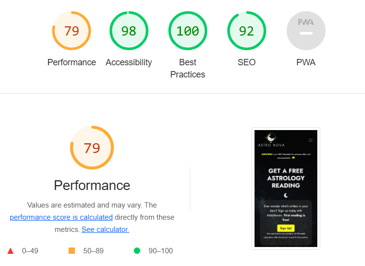

# **ASTRO NOVA** - Milestone Project 1

Welcome to my First Milestone project, AstroNova.
So...I've taken a leap of faith and enrolled in a Full Stack Development course. Am I mad? Quite possibly! 
But I have high hopes to begin on a new journey to switch my career and become a programmer. Up to this point in my career, I have specialised mainly in Graphic Design, this is ultimately my passion, I love to be a creative and deliver quality work.
The ability to be able to merge these two visual mediums is both challenging and exciting for me.

The purpose of this project is to showcase my learning and understanding of the modules and the languages I have learned this far at this point in the course, while I still have much to learn, I hope you understand my vision.
I'd like to thank you for viewing my Milestone 1 project and I very much hope you enjoy it as much as I have designing and developing it!

LIVE SITE

[You can view my live site here.](https://benjamesmason.github.io/astro-nova/)

GITHUB PAGES

[You can view my GitHub code pages here.](https://github.com/benjamesmason/astro-nova)

---

- [**ASTRO NOVA** - Milestone Project 1](#astro-nova---milestone-project-1)
  - [User Experience (UX)](#user-experience-ux)
    - [User Stories](#user-stories)
      - [Client Goals](#client-goals)
      - [First Time Visitor Goals](#first-time-visitor-goals)
      - [Returning User Goals](#returning-user-goals)
      - [Frequent User Goals](#frequent-user-goals)
  - [Design](#design)
    - [Colour Scheme](#colour-scheme)
    - [Typography](#typography)
    - [Imagery](#imagery)
    - [Wireframes](#wireframes)
    - [Features](#features)
      - [Current Features](#current-features)
      - [Future Features](#future-features)
  - [Technologies Used](#technologies-used)
  - [Testing](#testing)
    - [Code Validation](#code-validation)
    - [HTML Validation](#html-validation)
    - [CSS Validation](#css-validation)
    - [Browser Compatibility](#browser-compatibility)
    - [Responsiveness](#responsiveness)
    - [Lighthouse Testing](#lighthouse-testing)
  - [User Stories Testing](#user-stories-testing)
    - [Client Goals](#client-goals-1)
    - [First Time User Goals](#first-time-user-goals)
    - [Returning User Goals](#returning-user-goals-1)
    - [Frequent User Goals](#frequent-user-goals-1)
  - [Fixed Bugs](#fixed-bugs)
  - [Deployment](#deployment)
    - [Deploying the project to GitHub Pages](#deploying-the-project-to-github-pages)
    - [Forking the GitHub repository](#forking-the-github-repository)
    - [Making a local clone](#making-a-local-clone)
  - [Credits](#credits)
    - [Code](#code)
    - [Content](#content)
    - [Media](#media)
    - [Acknowledgements](#acknowledgements)

---

## User Experience (UX)

### User Stories

The Astro Nova website is a website designed for astrology enthusiasts that wish to engage, learn and self-develop in the spirirtual and astronomical community.
The website features some basic information where users can keep updated with their weekly horoscope's as well as personaly get in touch with proffesional expert astrologers. The key objective of the website however is to promote AstroNova + this is a premuim charged subscription currently on offer for a one weeks trial period, where a users sign's up they will gain membership that unlocks lots of enticing benefits. 

#### Client Goals

- To attract both beginner and experienced astrolgy enthusiasts.
- To attract a higher level of premuim members through the + membership incentives.
- To have an online presense which is both visually appealing and responsive which holds the ability for everybody to access and enjoy at all times.
- To be inclusive for all readers while easy and enjoyable to navigate.
- To welcome and inspire a passion for Astrology and Spiritualism, and to be a safe place of trust for its visitors.
 

#### First Time Visitor Goals

- To learn and discover more about astrology.
- To be able to easily access experts in the field all in one place that can be trusted.
- To navigate the website with ease, and access the simple information required quickly and without hassle.
- To be able to sign-up for memberships and newsletters quickly and simply.
- To be able to find the brands Social media handles all in one place so these can be accesible from one place.
- To have an overall enjoyable and positive experience while visitiing the site.
- To find a website with a clear layout that looks proffesional and trustworthy. 

#### Returning User Goals

- To access the brand's Social media account.
- To locate latest updated information about my horoscope.
- To choose to sign up for a premium membership and take advantage of current offers.

#### Frequent User Goals

- To locate latest updated information about my horoscope from a place that I can trust.
- To use premium member benefits, if becomming a AstroNova+ member.
- To get in touch with experts in the field at a time that is convenient for me.
- To be able to sign-in direct from the website to access acount.

## Design

### Colour Scheme

The colour scheme chosen for the Astro Nova website I wanted to keep fairly simplistic. With the Genre of the website being that of space and the stars I knew very early on that I wanted to go for a "dark theme" however, I wanted to keep the website looking clean and fresh. For this reason I based my colour scheme predominantly around 2 different colour variations, Black and Yellow. I believe the common use of Blacks and Dark Greys contrasted well with the pops of bright Yellow. Using the variations of Yellow also allowed me select certain content throughout the website that I wanted to draw the readers attention to which works creatively. 

I used [Coolors](https://coolors.co/000000-303030-484848-ffff00-cfcf4f) to generate my colour palette for the purpose of visual description.

### Typography

Because my main design vision for the Astro Nova Website was based around a clean and sleek visual I didn't feel it neccesary to overcomplicate when it came to selecting fonts. I wanted something professional looking that was also easy to read agianst the dark theme and imagery. I felt my selected font encompassed all I wanted it to, however I did decide to differentiate some heading elements from the main body text by experimenting with different font-weight's and also adding a text-shadow CSS property and believe this worked effectively while still staying on theme with the main body of content.

- The [Jost](https://fonts.google.com/specimen/Jost?query=jost) font is the main font used throughout the whole website with Sans-serif as the fallback font. I sourced this from [Google Fonts](https://fonts.google.com/)

- [Font Awesome](https://fontawesome.com/) icons were used throughout the site, such as the  moon icon and mail icons and also the social media icons found in the footer.

### Imagery

Imagery was an important factor to consider in the design process of the Astro Nova website. Due to the whole topic of the website itself being around that of stars and the cosmos, imagery plays a vital role in encapsulating and grabbing the reader's attention. The main purpose is to immerse visitors when they visit the webpage into an atomosphere you that you created!
I decided to keep image background's the same on all pages, other than The AstroNova+ webpage, this was an intentional move as I wanted this page in particular to stand out from the other areas of the website, it was also important to select images that were in keeping with the design and colour scheme.

The images used on the website were sourced from:

- Both background images used were sourced from [Pexels](https://www.pexels.com/),
- Logo was made by myself using [Adobe Illustrator](https://www.adobe.com/),
- All zodiac images were sourced from [All Free Downloads](https://all-free-download.com/) and then re-worked and designed by myself using [Adobe Illustrator](https://www.adobe.com/),
- 3 images from expert bio's were sourced from [Pexels](https://www.pexels.com/).

### Wireframes

Wireframes were created using [Balsamiq](https://balsamiq.com/wireframes/) - a wireframing software.

| Display | Screenshot |
| --- | --- |
| Mobile |  |
| Tablet |  |
| Desktop |  |
  
### Features

#### Current Features

The Astro Nova website consists of four main pages: Home, Experts, Horoscopes and AstroNova+ and two hidden pages that you are directed to upon completion of featured forms.

Some features run through all of them. These are:

- Page Logo - This includes the main page title (Astro Nova). Its black theme and design compliment the website design well, and the moon, planet and star graphics featured are fitting for the scope of the website. It appears on the top of every page within the website. It also works as a clickable link that will direct you back to the home page from any other page where featured
  

- The navigation bar - This feature stretches across the entire width of the screen and consists of links to all four available pages of the website. It was created using Boostrap and is fully responsive, scaling down to a hamburger style menu when viewed on small devices. The active tab will display a white colour when selected for all webpages other than "AstroNova+" (this is styled differently to draw user attention) while the remaining three are muted. All links also change color when a user hovers over them.
  

- Alert & Modal - The Alert and Modal also feautures on all four main webpages and also stretches across the entire width of the screen. It consists of the centered text "SUBSCRIBE to our FREE Newsletter for exclusive offers and announcements..." followed by a fontawesome mail icon, when a user clicks the capitalized word "SUBSCRIBE" this toggles the Modal into action, when there a user can decide to Subscribe to AstroNova by inputting their email address followed by clicking the button labelled "Join Us!" this will direct a user to a new webpage (subscribed.html) to instruct the user that they have successfuly signed up.

- Page Footer - This also stretches across the entire width of the screen. It consists of styled social media links in the center as well as some copyright information just below. This is fully responsive. Social media icons change their colour to bright yellow when a user hovers over them.

Home Page features:

- Jumbotron - The Jumbotron is the main focus and feature on the home page working as a direct call to action for new and visiting users, this adresses one of our main User Goals "To attract a higher level of premuim members through the + membership incentives." The Jumbotron was created using Bootstrap but has been fully styled with custom CSS. 

- Clickable Icons - This section is made up of two columns (on larger screens) and four columns (on smaller screens). It features 12 clickable icons that direct you to the horoscopes.html webpage. Each icon is custom designed and has been styled. Each icon will appear muted in colour when a user hover over it. I thought this to be a fun and functional way that users right from the homepage can engage and navigate interactively through the website and think this would work effectively.

Experts Page features:

- Introduction - A short introduction to the webpage prompting users to scroll down for further content. Headings have been styled simply with CSS, the h3 heading has been styled a shade of yellow to draw reader attention as well as the numbers "24/7" as a stand alone from the h5 heading, this addresses one of our user goals "To have an online presense which is both visually appealing and responsive which holds the ability for everybody to access and enjoy **at all times.**" 

- Experts Profiles - This section is comprised of three seperate "Expert Profiles". Each profile has been styled with CSS, the profile image and relative text are both contained as one and have been given a dark grey background colour with a transparency of 0.5 to give the profile better clarity against the background image and improve user readability. A hr element has also been implemented and styled with CSS to create a yellow line divider between the expert profile name and bio.

- Mailto Link and Icon - Within each expert profile a mail icon has also been added this was sourced from website Fontawesome. These icons have been styled with CSS to change the size and colour and also have a hover effect. Each icon has been enclosed in a anchor tag that includes a Mailto link, when this is clicked by a user they will be directed to their email page or application where they will be able directly send an email of their own choosing to the related expert. This addresses one of our First time Visitor goals "To be able to easily access experts in the field all in one place that can be trusted."

- Reviews Section - This section is comprised of two columns (larger screens) or four columns (smaller screens) in order to keep better responsive. Each review card has been styled with CSS, coloured yellow with a transparency of 0.25 and contain a speech icon sourced from website Fontawesome. 

Horoscopes Page features:

- Title and heading - Webpage title, with a short h3 heading that lets the user know the date's to which the content is related. Both styled with custom CSS.

- Horoscope cards - This section includes 12 seperate cards, one for each sign of the zodiac. On large screens two cards occupy a single row wheresas to keep better responsive smaller devices will display each card stacked on top of one another. Each card has been sized a styled with CSS and is accompanied by the relevant zodiac icon.

- Horoscope card Button - Each card incorporates a button and every button tag has been given the  Bootstrap class name of "collapse", when a user selects the button this toggles the collapsable text into action. This method of displaying text makes accesibility to information easier and the webpage as a whole more managable as a user doesn't need to scroll through lots of text that isn't applicable to them. This feature therefore addresses one of our First time Visitor Goals "To navigate the website with ease, and access the simple information required quickly and without hassle."

AstroNova + Page features:

- Title and heading - Webpage title, with a short h3 heading explaining free trial. Both heading elements have been styled to stand out behind the webpage background image and have been given a text-shadow CSS property.

- Checklist - A checklist has been added to accompany the above headings. This has been made with the use of tick icons sourced from the website FontAwesome and styled together with custom CSS to display an unordered list of incentives that could appeal to website users, this addresses one of our client goals "To attract a higher level of premuim members through the + membership incentives" All incentives have been grouped and styled in a semi-transparent box to grab user attention and improve user readability.

- Form - The registration form is comprised of two text inputs, one password input, one date input and one checkbox input followed by a sumbit button. The form was created with Bootstrap classes but also has custom CSS. Submission of the form will allow the user to access Astro Nova with a premium membership and unlock all benefits. When the form is sumbitted successfully the user will be directed to a registration complete page that will thank them for joining AstroNova+. The form is easily readable free of background image and simple to follow which addresses one of our First time Visitor Goals "To be able to sign-up for memberships and newsletters quickly and simply."

#### Future Features

Sign in Feature - to allow members to be able to access their accounts and benefits direct from the website. (to meet frequent user goal).

Message us feature - a working "message us" feature implemented in a form layout that can be used to actualy recieve and respond to user queries.

Planet tracker feature - Additional webpage that would allow users to track in real time planetary and star alignments and what that would mean for them astrologicaly.

## Technologies Used

- [HTML](https://developer.mozilla.org/en-US/docs/Web/HTML)
  - Used as the basic building block for the project and to structure the content.

- [CSS](https://developer.mozilla.org/en-US/docs/Learn/Getting_started_with_the_web/CSS_basics)
  - Used to style all the web content across the project.

- [Bootstrap](https://getbootstrap.com/)
  - Used as the main framework to make the project responsive.

- [JavaScript](https://www.javascript.com/)
  - Used for the Bootstrap Modal across the website.

- [Google Fonts](https://fonts.google.com/)
  - Used to obtain the Jost font.

- [Font Awesome](https://fontawesome.com/)
  - Used to obtain the social media, moon and mail icons used.

- [Google Developer Tools](https://developers.google.com/web/tools/chrome-devtools)
  - Used as a primary method of fixing spacing issues, finding bugs, and testing responsiveness on a wide range of device viewpoints across the project.

- [Github](https://github.com/)
  - Used to store code for the project after being pushed.

- [Git](https://git-scm.com/)
  - Used for version control by utilizing the Gitpod terminal to commit to Git and Push to GitHub.

- [Code Anywhere](https://codeanywhere.com/)
  - Used as the development enviroment.

- [Balsamiq](https://balsamiq.com/)
  - Used to create the wireframes for the project.

- [Free Convert](https://www.freeconvert.com/jpg-to-webp)
  - used to convert jpg images to webp format.

## Testing

### Code Validation

[The W3C Markup Validation Service](https://validator.w3.org/) and [The W3C CSS Validation Service](https://jigsaw.w3.org/css-validator/) were used to validate every page of the project to ensure there were no syntax errors. The results clearly showed that the website stays in compliance with the standards and recommendations set by the World Wide Web Consortium.

### HTML Validation

I have used the recommended [HTML W3C Validator](https://validator.w3.org) to validate all of my HTML files. No errors or warnings were found.

| Page | W3C URL | Screenshot | Notes |
| --- | --- | --- | --- |
| Home | [W3C](https://validator.w3.org/nu/?doc=https%3A%2F%2Fbenjamesmason.github.io%2Fastro-nova%2F) |  | Pass: No Errors |
| Experts | [W3C](https://validator.w3.org/nu/?doc=https%3A%2F%2Fbenjamesmason.github.io%2Fastro-nova%2Fexperts.html) |  | Pass: No Errors |
| Horoscopes | [W3C](https://validator.w3.org/nu/?doc=https%3A%2F%2Fbenjamesmason.github.io%2Fastro-nova%2Fhoroscopes.html) |  | Pass: No Errors |
| AstroNova+ | [W3C](https://validator.w3.org/nu/?doc=https%3A%2F%2Fbenjamesmason.github.io%2Fastro-nova%2Fastronova-plus.html) |  | Pass: No Errors |
| Success your Subscribed! | [W3C](https://validator.w3.org/nu/?showsource=yes&doc=https%3A%2F%2Fbenjamesmason.github.io%2Fastro-nova%2Fsubscribed.html%3F) |  | Pass: No Errors |
| Success your Registered! | [W3C](https://validator.w3.org/nu/?showsource=yes&doc=https%3A%2F%2Fbenjamesmason.github.io%2Fastro-nova%2Fregistered.html%3F) |  | Pass: No Errors |

### CSS Validation

I have used [CSS Jigsaw Validator](https://jigsaw.w3.org/css-validator) to validate my CSS file. No errors were found.

| File | Jigsaw URL | Screenshot | Notes |
| --- | --- | --- | --- |
| style.css | [Jigsaw](https://jigsaw.w3.org/css-validator) |  | Pass: No Errors |

### Browser Compatibility

I have tested my deployed the AstroNova website on multiple browsers to check for compatibility issues.

| Browser | Screenshot | Notes |
| --- | --- | --- |
| Chrome |  | Works as expected |
| Firefox |  | Works as expected |
| Edge |  | Works as expected |
| Opera |  | Works as expected |

### Responsiveness

I have tested my deployed the AstroNova website on multiple device frames throughout it's creation to check for responsiveness issues. It appears to responds well to different screen sizes which ensures that users can access and navigate website content with ease regardless of the device they use.

| Device | Screenshot | Notes |
| --- | --- | --- |
| Mobile (DevTools) |  | Works as expected |
| Tablet (DevTools) |  | Works as expected |

### Lighthouse Testing

I have tested my deployed project using the Lighthouse Audit tool to check for any major issues. Inital scores were quite low, because the website contained images in jpeg format. For this reason, I have converted all of my jpeg image files to webp format. It has greatly improved the performance.

| Page | Size | Screenshot | Notes |
| --- | --- | --- | --- |
| Home | Mobile |  | Few warnings |
| Home | Desktop |  | Few warnings |
| Experts | Mobile |  | Few warnings |
| Experts | Desktop |  | Few warnings |
| Horoscopes | Mobile |  | Few warnings |
| Horoscopes | Desktop |  | Few warnings |
| AstroNova+ | Mobile |  | Few warnings |
| AstroNova+ | Desktop |  | Few warnings |
| Registered | Mobile |  | Some minor warnings |
| Registered | Desktop |  | Some minor warnings |
| Subscribed | Mobile |  | Some minor warnings |
| Subscribed| Desktop |  | Some minor warnings |

## User Stories Testing

### Client Goals

| User Stories | Completed? |
| --- | --- |
| As a client I would like to attract both beginner and experienced astrolgy enthusiasts to the website. | ✔️ |
| As a client I would like to attract a higher number of premuim members through the + membership incentives. | ✔️ |
| As a client I would like this website to have an online presense which is both visually appealing and responsive that allows the ability for everybody to access and enjoy at all times. | ✔️ |
| As a client I want a website that is inclusive for all readers while easy and enjoyable to navigate.  | ✔️ |
| As a client I want to welcome and inspire a passion for Astrology and Spiritualism through a webiste, and to be a safe place of trust and joy for its users. | ✔️ |

### First Time User Goals

| User Stories | Completed? |
| --- | --- |
| As a first time user, I want to opportunity to be able to learn more about astrology. | ✔️ |
| As a first time user, I want to be able to access experts in the field all in one place that can be trusted. | ✔️ |
| As a first time user, I want to navigate a website with ease, and simply access the information I require quickly and without hassle. | ✔️ |
| As a first time user, I want to be able to sign-up for memberships and newsletters quickly and simply.  | ✔️ |
| As a first time user, I want to be able to find the website Social media accounts easily and access them all in one place.  | ✔️ |
| As a first time user, I want to have an overall enjoyable and positive experience while visitiing the a website. | ✔️ |
| As a first time user, I want to find a website with a clear layout that looks proffesional and trustworthy. | ✔️ |

### Returning User Goals

| User Stories | Completed? |
| --- | --- |
| As a returning user, I want to access the brand's social media accounts.| ✔️ |
| As a returning user, I should be able to locate latest updated information about my horoscope. | ✔️ |
| As a returning user, I want to be able to choose to sign up for a premium membership and take advantage of current offers. | ✔️ |

### Frequent User Goals

| User Stories | Completed? |
| --- | --- |
| As a frequent user, I should be accessing the very latest updated information about my horoscope from a place that I can trust. | ✔️ |
| As a frequent user, I want to use premium member benefits, if becomming a AstroNova+ member. | As explained in Future Feature Section this would be something I would like to implement in the future so users can access their accounts and benefits direct from the website. |
| As a frequent user, I want to to be able to sign-in direct from the website to access my account.| As explained in Future Features Section a sign-in feature would be something I would like to apply in future in order to fulfil this user goal.  |

## Fixed Bugs

## Deployment

### Deploying the project to GitHub Pages

1. Log in to your GitHub account and locate the repository you would like to deploy.
2. Navigate to the "Settings" tab at the top of your selected repository.
3. Select "Pages" from the menu on the left-hand side of the screen.
4. Make sure the "Select" dropdown menu shows "Deploy from a branch".
5. From the "Branch" dropdown menu select "Main" and click "Save".
6. The page will automatically refresh and display the link to your deployed website.

### Forking the GitHub repository

By forking the repository, you make a copy of the original repository on your GitHub account to view or to make changes to, without affecting the original repository.

1. Log in to your GitHub account and locate the repository you would like to fork.
2. At the top of the repository on the right-hand side of the screen, locate the "Fork" button.
3. After clicking on it, you should have your own copy of the original repository in your GitHub account.

### Making a local clone

Making a clone is basically making a copy of the selected repository.

1. Log in to your GitHub account and locate the repository you would like to clone.
2. Click on the "Code" button just under the repository name.
3. Copy the HTTPS link from the website address bar.
4. Open a GitBash terminal and locate the directory where you want to place the clone.
5. Type 'git clone' and then paste the URL you copied earlier.
6. Press enter. Then your local clone will be created.

## Credits

### Code

- [W3Schools](https://www.w3schools.com/)
  - Helping to find to solution for modal operating issues by use of #data-target element not correctly implemented..
  - Research for example use of the hover affect for CSS for clickable elements.

- [Matt Rudge, Code Institute](https://codeinstitute.net/)
  - Callout container stylings on Home Page.
  - Jumbotron layout (inspired from WhiskeyDrop website)
  - Inspiration behind styled "hr" element to form a solid decorational line.
  
- [MD Bootstrap](https://mdbootstrap.com/docs/)
  - Inspiration for footer layout.

- [Bootstrap Verson 4.1.3](https://getbootstrap.com/)
  - Bootstrap Library used throughout the project for responsivity such as container-fluid class.
  - Bootstrap Docs for help and inspiration for form layout.

### Content

- [Elle Website](https://www.elle.com/horoscopes/weekly/) - for content contained in all twelve weekly horoscope's located in the "Horoscope Section" section of the "Horoscopes" page.
- [Sanctuary World](https://www.sanctuaryworld.co/readers/) - for content found in each reader profile contained in the "Expert Readers" section of the "Experts" page.
- [NASA](https://www.nasa.gov/) - Used for content inspiration throughout the project.
- [Astrology](https://www.astrology.com/us/home.aspx) - Used for content inspiration throughout the project.
- [AstroTalk](https://astrotalk.com/) - Used for content inspiration throughout the project.

### Media

Background Imagery across website + Images featured on Experts webpage:
- [Pexels](https://www.pexels.com/),

All Zodiac Images (Although not direct copies and have been reworked and designed by myself using Adobe Illustrator for the purpose of this website design).
- [All Free Downloads](https://all-free-download.com/).

### Acknowledgements

- [Nigel Edwards](https://slack.com/) (College of West Anglia cohort facilitator) - for his continued support and guidance throughout this course and his words of encouragment when I've felt overwhelmed. 
- [Code Institute Slack Community](https://code-institute-room.slack.com) - for the moral support and advice from my fellow students, this has made me feel understood and has kept me going through periods of Imposter Syndrome.
- Tiffany, Bowie & Indie - in periods of struggle looking at my family has given me the daily reminder that everything I do is for them. Thank you to my partner for keeping our crazy ship sailing during my late nights both working and studying, and for putting up with my persistant talk of code! I love you all.
